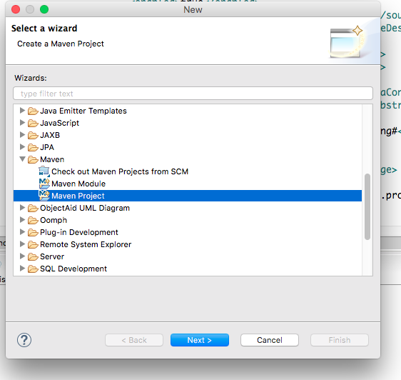
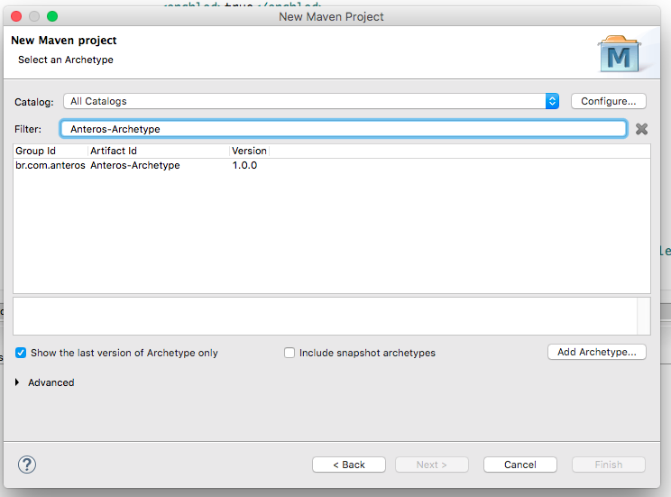
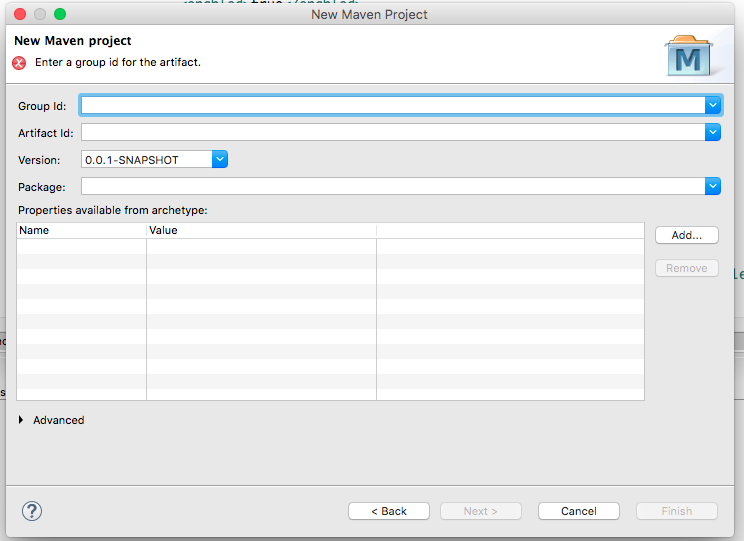
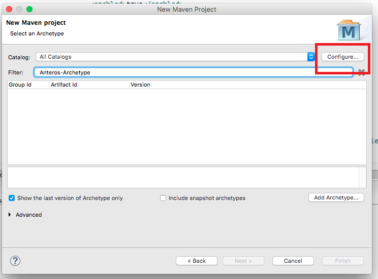
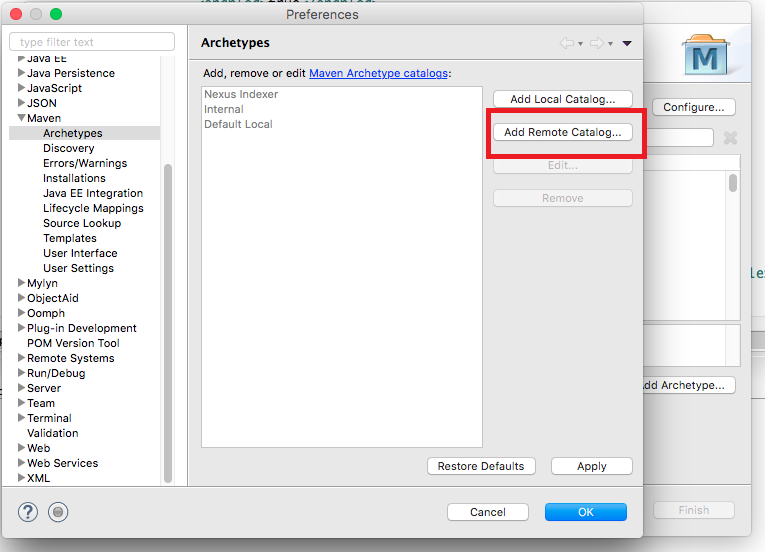
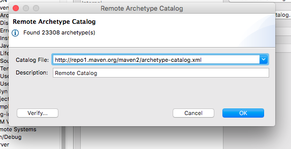

# Anteros Archetype Webapp
O **Anteros Archetype Webapp**  é um archetype maven utilizado para gerar projetos web utilizando os frameworks Anteros.

## Introdução

Os archetypes do maven são templates contendo alguns arquivos de configuração com uma estrutura inicial pré-definida. 

Ao utilizar o Anteros Archetype já estão inclusos os frameworks: 

 * [Anteros Persistence](https://github.com/anterostecnologia/anterospersistence) - Utilizado para persistência de dados em Java.
 
 * [Anteros Spring](https://github.com/anterostecnologia/anterosspring) - Framework para integração do Anteros Persistence com Spring na camada de serviço inclusive controle transacional.
 
 * [Anteros Security](https://github.com/anterostecnologia/anterossecurity) e [Anteros Security Spring](https://github.com/anterostecnologia/anterossecurityspring) - Implementação do Spring Security para uso com o modelo de segurança do Anteros.
 
 * [Anteros Generator Maven Plugin](https://github.com/anterostecnologia/anterosgeneratormavenplugin) - Plugin do maven para geração de serviços, repositórios e controles do Spring para as classes selecionadas do modelo, podendo inclusive gerar classes para o modelo de segurança.
 
 * [Anteros Rest Documentation](https://github.com/anterostecnologia/anterosrestdocmavenplugin) - Plugin do maven para geração automática de documentação de API's REST tanto para Spring como para JAX-RS.
 
 * [Anteros Log4j Web Tracker](https://github.com/anterostecnologia/anteroslog4jwebtracker) - Ferramenta web utilizada para configurar e visualizar em tempo real os logs do Apache Log4j da aplicação.
 
 * Javadoc com [UMLGraph](https://github.com/dspinellis/UMLGraph) - Geração do javadoc da aplicação com gráficos UML.
 
 ## Utilização
 
 Para utilizar o Anteros Archetype Webapp no Eclipse IDE siga os seguintes passos: 
 
 1. Abra a IDE
 
 2. File > New > Others > Maven > Maven Projects > Next
 
 
 
 3. Selecione a localização do projeto > Next
 
 4. Filtre os archetypes pelo nome: **Anteros-Archetype** e selecione o '_br.com.anteros:Anteros-Archetype:<versão>_' > Next
 
 
 
 5. Insira os valores para os parâmetros necessários: GroupId, ArtifactId, Version e Package > Finish
 
 
 
 6. Altere os valores do pom.xml do projeto gerado de acordo com suas especificações.
 
 7. Altere os valores do arquivo src/main/WEB-INF/anterosConfiguration.properties de acordo com suas especificações.
 
 
 **Obs: Se não aparecer o Anteros-Archetype na lista do item 4 será necessário configurar para o Eclipse IDE reconhecer os archetypes externos, conforme instruções abaixo:**
 
 1. Selecione _Configure..._
 
  
 
 2. Selecione _Add Remote Catalog..._
 
  
 
 3. No item _Catalog File_ adicione a URL 'http://repo1.maven.org/maven2/archetype-catalog.xml' e uma descrição
 
  
 
 4. Clique em OK e pronto. Agora deve aparecer o Anteros-Archetype para selecionar
 
  
  
## Licença ##

Apache 2.0

http://www.apache.org/licenses/LICENSE-2.0

  

Anteros Tecnologia

 
